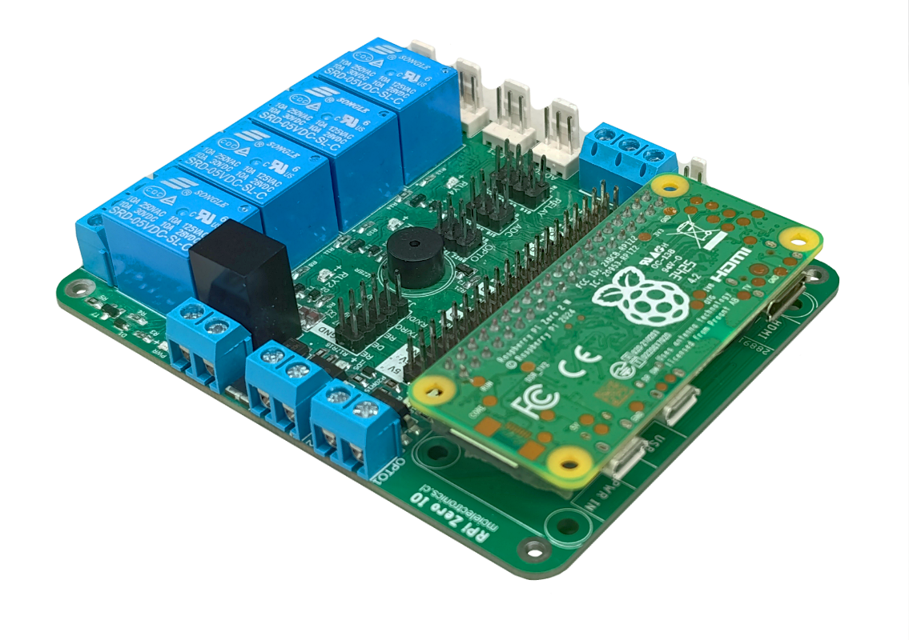
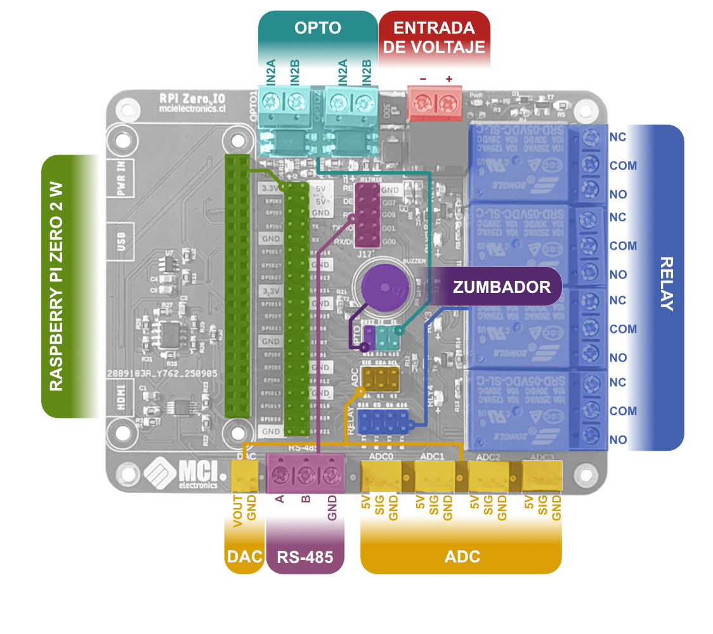
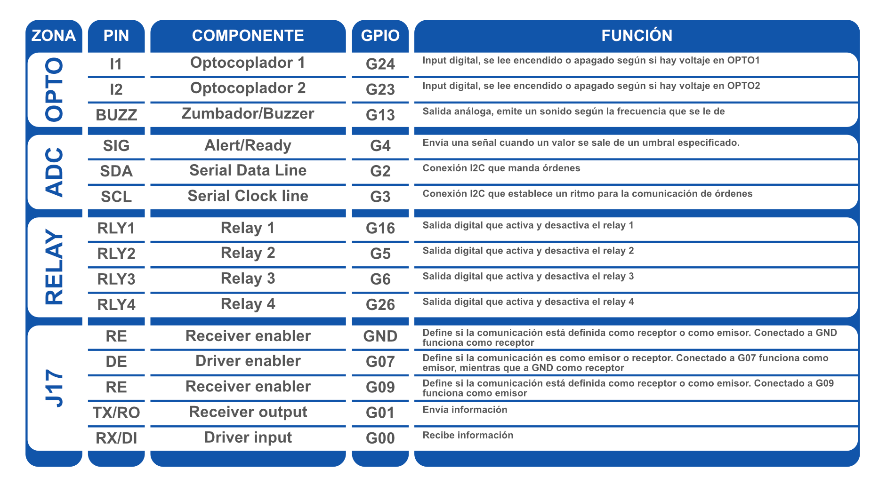
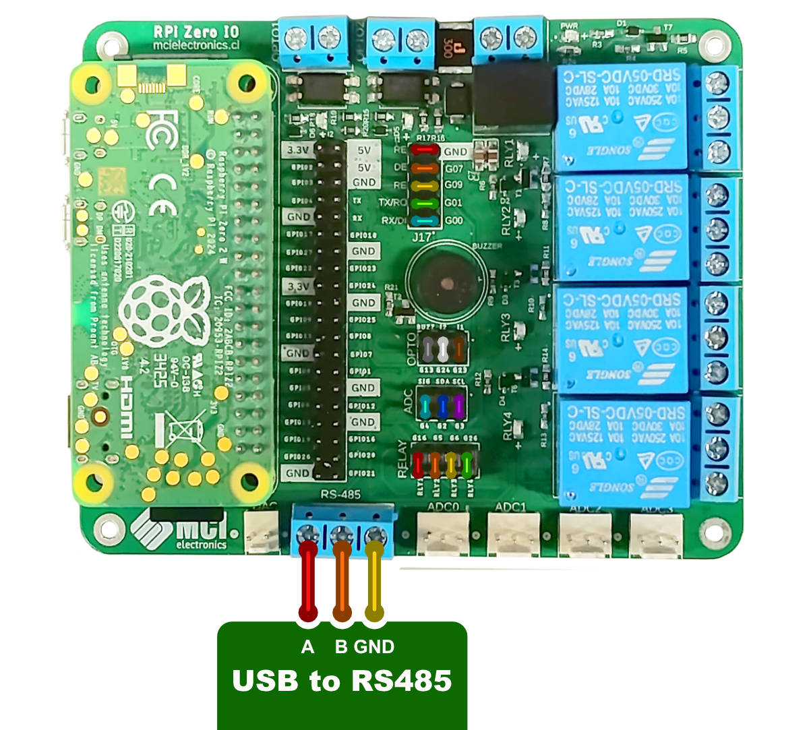

# Rpi Zero IO



**RPI Zero IO** es una tarjeta compatible con [Raspberry Pi Zero 2 W](https://mcielectronics.cl/shop/product/raspberry-pi-zero-2-w/) preparada para inputs y outputs de alto voltaje, ideal para control y automatización. Sus 4 entradas análogas permiten un manejo de requerimiento industrial de forma ordenada, facilitando el monitoreo. También tiene 2 entradas aisladas con optoacopladores, siendo entradas digitales de hasta 24V. Por otro lado, sus 4 relés ayudan con el manejo de elementos externos de alta demanda de voltaje. Esto se complementa con un zumbador, que permite mantener a alerta los cambios que se puedan detectar.

## Características principales

- Compatible con [Raspberry Pi Zero 2 W](https://mcielectronics.cl/shop/product/raspberry-pi-zero-2-w/)
- Componentes: 4 Relés, 2 Optoacopladores, 1 Zumbador, Comunicación RS-485, entrada de voltaje (9 – 24VC), 1 Conversor digital a análogo y 4 Entradas análogas ADC conectadas por I2C.
- Conexiones: Header para Raspberry Pi Zero 2 W, terminales para el voltaje, RLY 1 – RLY4 (Relays), ADC0 – ADC3 (Inputs análogos), I1 e I2 (Inputs digitales con optoacoplador).
- Voltaje soportado: 9 – 24VDC en la entrada de voltaje, 250 VAC – 30VDC en relés
- Agujeros de montaje M2.5
- Además, incluye headers conectados directamente a pins de la Raspberry Pi Zero 2 W, pero aproximados a los componentes compatibles de la tarjeta para agilizar el cableado, mantener orden y permitir al usuario elegir si optar o no por estas.

## Pins y conexiones




## Requerimientos de hardware

- Computador
- Cable micro USB o fuente de voltaje
- Cables hembra-hembra
- Tarjeta microSD
- Adaptador de microSD a USB
- Raspberry Pi Zero 2 W

## Requerimientos de software

- [Raspberry Pi Imager](https://www.raspberrypi.com/software/)
- [Commix](https://xiazai.zol.com.cn/detail/27/263403.shtml)

## Configuración de la Raspberry

Antes de utilizar la tarjeta Raspberry Pi Zero 2 W, se debe configurar desde la tarjeta **microSD** con **Raspberry Pi Imager**. Empezamos seleccionando nuestro dispositivo como Raspberry Pi Zero 2 W. En Sistema Operativo (SO) tenemos que seleccionar que utilizaremos “otro sistema operativo de uso general” para poder controlar la tarjeta con nuestro computador. En la sección de almacenamiento seleccionamos nuestra tarjeta SD.  Luego solo necesitamos crear un usuario y configurar el internet al mismo que utiliza el computador desde el vamos a programar nuestros códigos. Con esto terminado, podemos insertar la tarjeta SD a la Raspberry.

Para utilizar la tarjeta necesitamos energizarla. Con la tarjeta Raspberry Pi Zero IO podemos utilizar una fuente de poder externa de 9 a 24 V. Después de menos de 3 minutos, se puede encontrar la tarjeta desde el computador en el Símbolo del Sistema (o CMD) utilizando el comando de linux `ssh remote_username@remote_host`

## Configuración de I2C y Puerto Serial

Antes de pasar a los códigos, necesitamos también **activar el protocolo I2C** (necesitado para las funciones ADC y DAC) y el **monitor serial** (para la comunicación RS485). Para esto, escribimos el comando `sudo raspi-config`, desde el cual accederemos a “Interfacing Options”. Aquí seleccionamos I2C y confirmamos que queremos activarlo. Volviendo a Interfacing Options también seleccionamos Monitor Serial, desde el cual se nos pide confirmar si se quiere activar el Login Shell, al cual seleccionas que “Si” en caso de que quieras controlar la Raspberry Pi desde un terminal del puerto serial. Si quieres usar el puerto serial para controlar otros dispositivos, selecciona “No”, como será necesario en los ejemplos. Luego, se pide confirmar que se quiera activar el puerto serial, a lo cual hay que indicar “Si”. Es necesario reiniciar la Raspberry.
Una vez la Raspberry esté encendida y conectada de nuevo, hay que instalar las utilidades de I2C tools con `sudo apt update` y `sudo apt install i2c-tools python3-smbus`.

## Cargar un código

Para escribir un código en nuestra Raspberry Pi Zero 2 W tenemos que utilizar el comando `nano NombreDelCódigo.py`, lo cual nos abrirá una pestaña para escribir el código. Es importante tener en cuenta que esto es en Python. Una vez se termine, podemos presionar Ctrl+X y guardar el código. Para cargarlo solo hay que escribir `python3 NombreDelCódigo.py`, y para interrumpirlo presionar Ctrl+C.

## Conexiones



## Ejemplo1: Lectura de los Optocopladores
El ejemplo lee las entradas de los optocopladores, indicando si estos están siendo activados o no.

```python
import RPi.GPIO as GPIO
import time

# ================= CONFIG =================
OPTO_1 = 23
OPTO_2 = 24

GPIO.setmode(GPIO.BCM)
GPIO.setup(OPTO_1, GPIO.IN, pull_up_down=GPIO.PUD_UP)
GPIO.setup(OPTO_2, GPIO.IN, pull_up_down=GPIO.PUD_UP)

print("🟢 Lectura de optoacopladores iniciada (Ctrl+C para salir)")
try:
    while True:
        estado1 = GPIO.input(OPTO_1)
        estado2 = GPIO.input(OPTO_2)
        print(f"Opto 1 (GPIO23): {'ACTIVO  ' if estado1 == 0 else 'INACTIVO'} | "
              f"Opto 2 (GPIO24): {'ACTIVO  ' if estado2 == 0 else 'INACTIVO'}")
        time.sleep(0.5)
except KeyboardInterrupt:
    print("\nSaliendo...")
finally:
    GPIO.cleanup()
```
